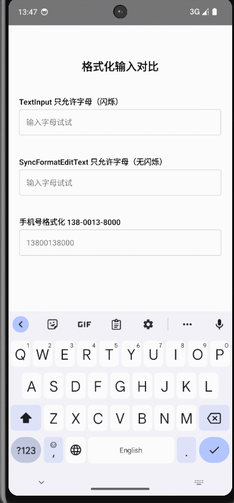
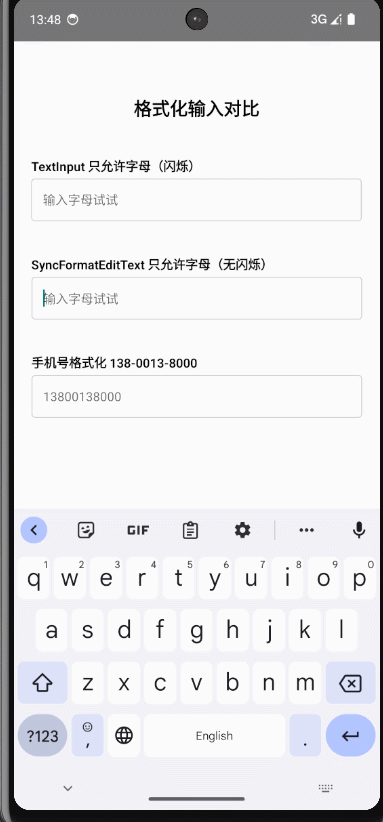
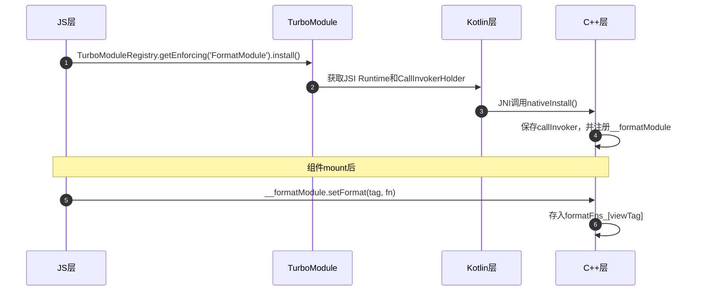
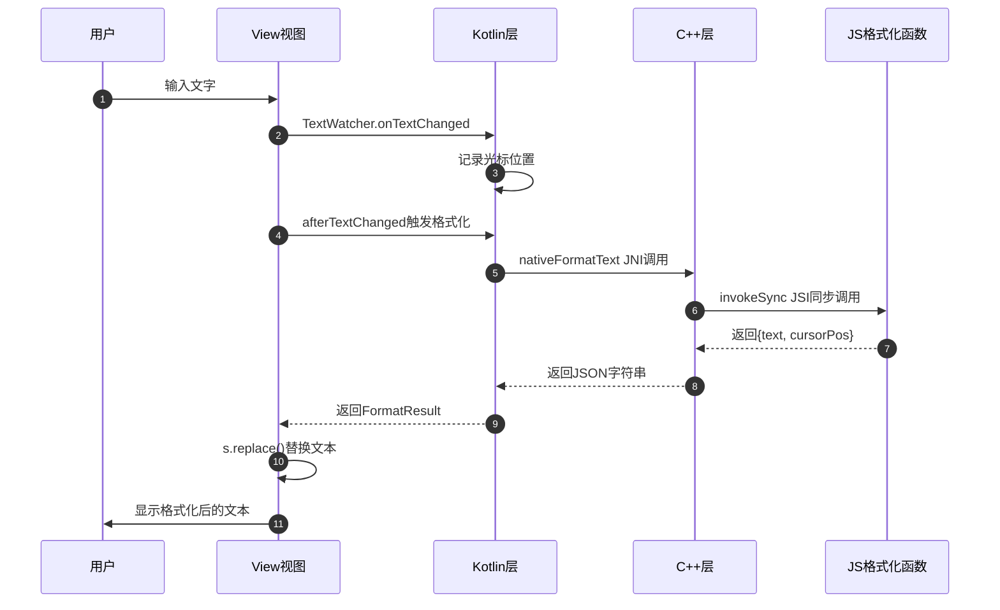

# react-native-sync-format-edittext

React Native 同步格式化输入框 — 无闪烁的实时文本格式化

## 功能介绍

在 React Native 中对 TextInput 做实时格式化（如手机号 `138-0013-8000`），通常需要监听 `onChangeText`，在 JS 层格式化后再通过 `value` 回写。这个过程中文本要经过异步桥接往返，导致输入时出现明显的闪烁和光标跳动。

本库通过 **JSI 同步调用**，让原生层在文本变化时直接同步调用 JS 的格式化函数，格式化结果立即生效，彻底消除闪烁。同时继承自原生 TextInput，支持所有原生 props。

### 平台支持

| 平台 | 状态 |
|---|---|
| Android | ✅ 已支持 |
| iOS | 🚧 开发中 |

> ⚠️ 需要 React Native **0.76.2** 及以上版本 ，不然codegen会导致无法编译

## 演示效果

| **原生 TextInput 格式化 — 闪烁明显** | **SyncFormatEditText — 无闪烁** |
|---|---|
|  |  |

## 安装

```sh
npm install @azsxdc12356/react-native-sync-format-edittext
```

支持新架构和旧架构，autolink 自动完成链接。

## 使用

```tsx
import { SyncFormatEdittextView } from '@azsxdc12356/react-native-sync-format-edittext';

// 只允许输入数字
function formatDigits(text: string, cursorPos: number) {
  const digits = text.replace(/\D/g, '');
  const removedBeforeCursor = text.slice(0, cursorPos).replace(/\d/g, '').length;
  return {
    text: digits,
    cursorPos: cursorPos - removedBeforeCursor,
  };
}

<SyncFormatEdittextView
  value={code}
  format={formatDigits}
  onChangeText={setCode}
  placeholder="请输入验证码"
  style={styles.input}
/>
```
## 待办

- [ ] 另一个分支feat_use_event是不使用jsi的方式，用纯事件的异步方式来做，现在只能做到不闪烁，但是还有很多bug

## 整体流程架构

- 详细介绍可以看我的[掘金文章](https://juejin.cn/user/712139263718983)

### 初始化链路



关键点：

*   `install()` 只在 App 生命周期执行一次，通过模块级 `installPromise` 保证
*   `setFormat` 在组件 mount 时注册，组件 unmount 时通过 `removeFormat` 清理
*   C++ 层用 `unordered_map<int, shared_ptr<jsi::Function>>` 存储函数，key 是 viewTag

### 运行时链路

用户输入时，数据从原生到 JS 再返回原生的完整流程：



整条链路是**同步的**。从 TextWatcher 触发到文本替换完成，都在同一个 UI 线程事件循环中，没有异步等待，所以不会闪烁。


**防递归机制**：`afterTextChanged` 中调用 `s.replace()` 会再次触发 TextWatcher。C++ 层通过 `isFormatting` 标志位阻止递归：

```kotlin
override fun afterTextChanged(s: Editable?) {
    if (isFormatting) return  // 正在格式化，跳过递归
    // ... 执行格式化 ...
    isFormatting = true
    s?.replace(0, s.length, result.text)  // 会再次触发 TextWatcher
    // 但因为 isFormatting == true，递归调用直接 return
    isFormatting = false
}
```

**防循环机制**：JS 层通过 `value` prop 回写时，`lastFormattedText` 跳过重复值：

```kotlin
if (currentText == lastFormattedText && selectionStart == lastFormattedCursorPos) {
    onFormatListener?.invoke(currentText, lastFormattedCursorPos)
    return
}
```


### 新老架构兼容

React Native 从 0.68 开始引入新架构（Fabric + TurboModule）最低应该能支持到0.76（因为codeGen在这里有一次改版），但很多项目仍在使用老架构。本组件通过 `sourceSets` 实现同时支持：

```groovy
// android/build.gradle
sourceSets {
  if (rootProject.hasProperty("newArchEnabled") &&
      rootProject.getProperty("newArchEnabled") == "true") {
    main.java.srcDirs += "src/newarch/java"
  } else {
    main.java.srcDirs += "src/oldarch/java"
  }
}
```

核心差异：

*   **新架构**：`FormatModule` 继承 CodeGen 生成的 `NativeFormatModuleSpec`，`ViewManager` 使用 `UIManagerHelper` 派发事件
*   **老架构**：`FormatModule` 继承 `ReactContextBaseJavaModule`，`ViewManager` 使用 `UIManagerModule` 获取 dispatcher

共享的 `FormatModuleImpl` 和 `SyncFormatEdittextView` 放在 `src/main/java/` 下，不区分架构。

## API

### Props

继承所有 `TextInputProps`，额外支持以下 props：

| Prop | 类型 | 说明 |
|---|---|---|
| `format` | `(text: string, cursorPos: number) => { text: string; cursorPos: number }` | 格式化函数，接收当前文本和光标位置，返回格式化后的文本和调整后的光标位置 |
| `onSyncFormatChange` | `(text: string, cursorPos: number) => void` | 格式化完成后的回调，返回格式化后的文本和光标位置 |

### `format` 函数详解

`cursorPos` 是字符在字符串中的索引（从 0 开始）。格式化后文本长度可能改变，光标位置需要相应调整，否则会跳到错误位置。

**原理**：`cursorPos` 表示"光标在第几个字符前面"。格式化后，你需要计算光标在格式化文本中的对应位置。如果格式化只是过滤字符（文本变短），光标位置 = 原位置 - 光标前被过滤掉的字符数；如果格式化插入了分隔符（文本变长），还需要再加上光标前新增的分隔符数量。

**示例 1：只过滤，不插入字符**

输入 `a1b2`，光标在末尾（cursorPos=4）。过滤非数字后得到 `12`，光标前被过滤了 2 个字符，所以 cursorPos=4-2=2。

```ts
function formatDigits(text: string, cursorPos: number) {
  const digits = text.replace(/\D/g, '');
  const removedBeforeCursor = text.slice(0, cursorPos).replace(/\d/g, '').length;
  return {
    text: digits,
    cursorPos: cursorPos - removedBeforeCursor,
  };
}
```

过滤不改变字符顺序，光标位置 = 原位置 - 光标前被过滤掉的字符数。

**示例 2：插入分隔符**

输入 `1380013`，光标在末尾（cursorPos=7）。格式化为 `138-0013`，光标前多了一个 `-`，所以 cursorPos=8。

```ts
function formatPhone(text: string, cursorPos: number) {
  const beforeCursor = text.slice(0, cursorPos);
  const removedBeforeCursor = beforeCursor.replace(/\d/g, '').length;
  const adjustedPos = cursorPos - removedBeforeCursor;

  const digits = text.replace(/\D/g, '').slice(0, 11);
  let formatted = '';
  let newCursorPos = adjustedPos;
  if (digits.length <= 3) {
    formatted = digits;
  } else if (digits.length <= 7) {
    formatted = `${digits.slice(0, 3)}-${digits.slice(3)}`;
    if (adjustedPos > 3) newCursorPos = adjustedPos + 1;
  } else {
    formatted = `${digits.slice(0, 3)}-${digits.slice(3, 7)}-${digits.slice(7)}`;
    if (adjustedPos > 3) newCursorPos = adjustedPos + 1;
    if (adjustedPos > 7) newCursorPos = adjustedPos + 2;
  }
  return {
    text: formatted,
    cursorPos: Math.min(newCursorPos, formatted.length),
  };
}
```

关键逻辑：先用 `cursorPos - removedBeforeCursor` 得到纯数字中的位置，再根据分隔符偏移。光标每跨过一个分隔符位置，`cursorPos` 就 +1。

更多示例参见 [example](./example/src/App.tsx)。

## License

MIT
